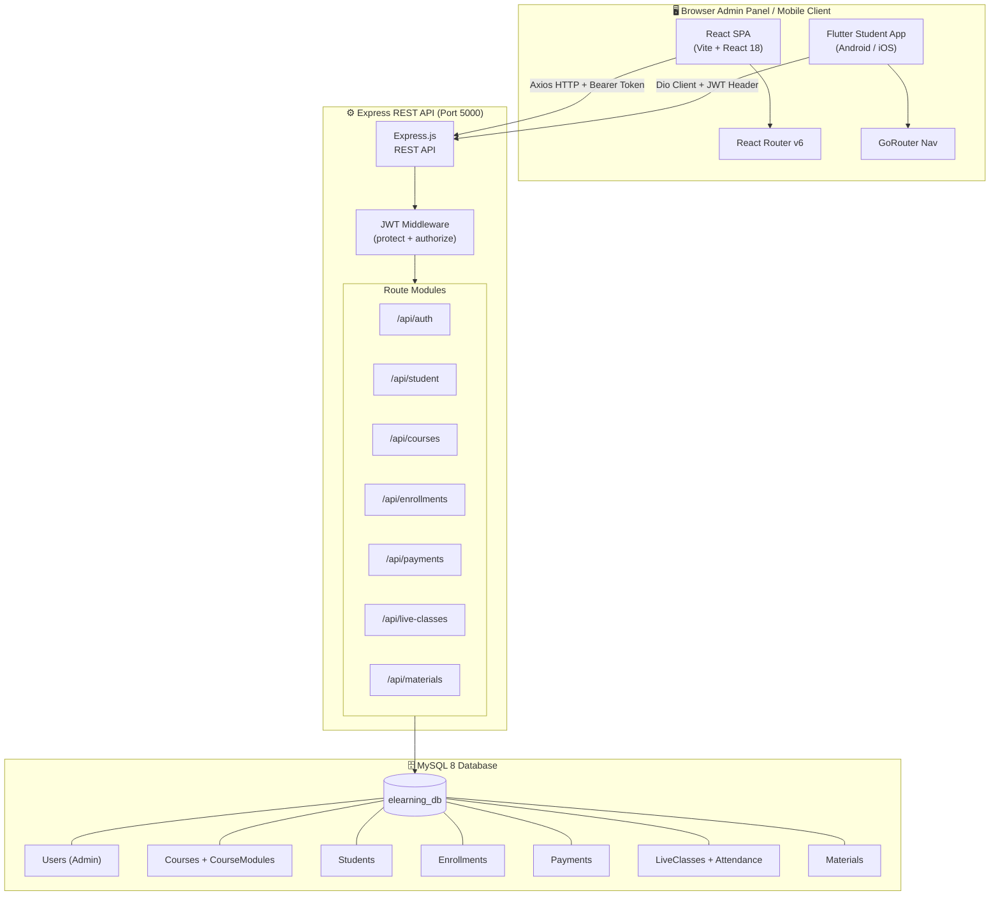
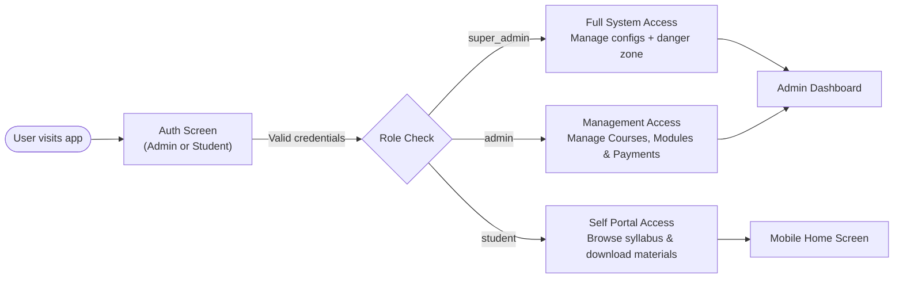
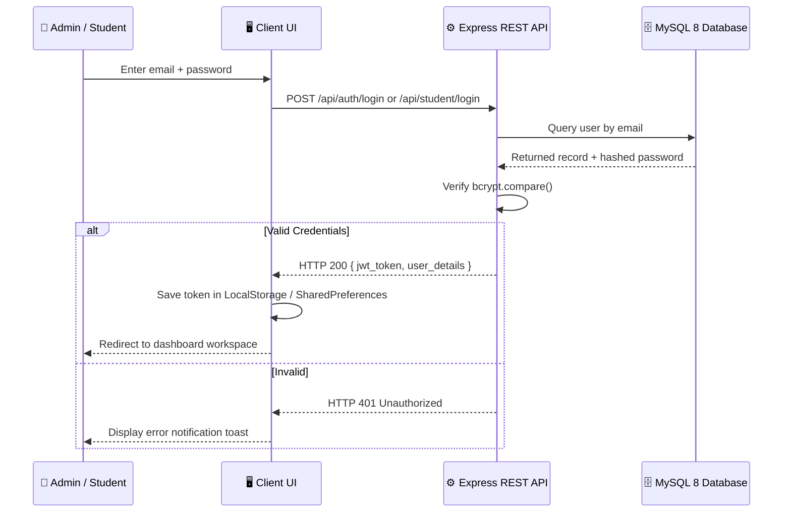
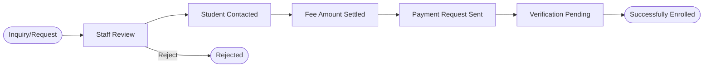
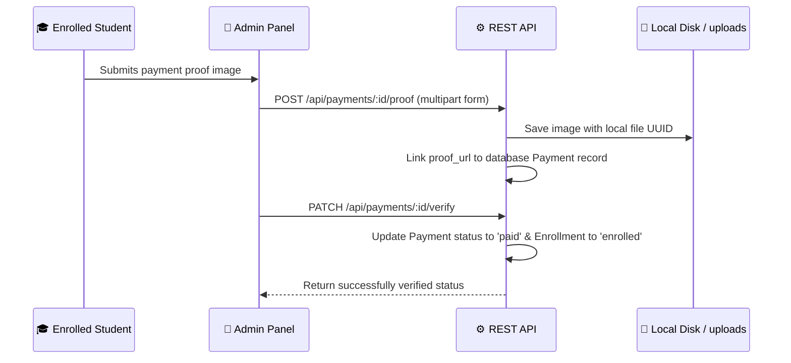
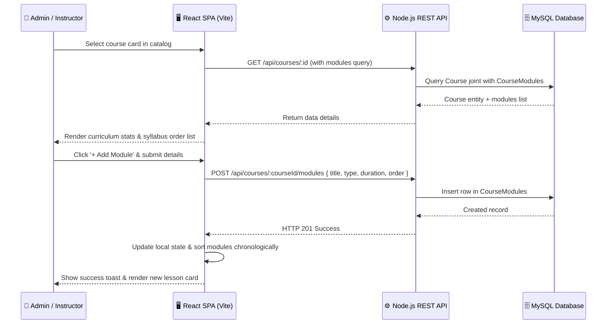
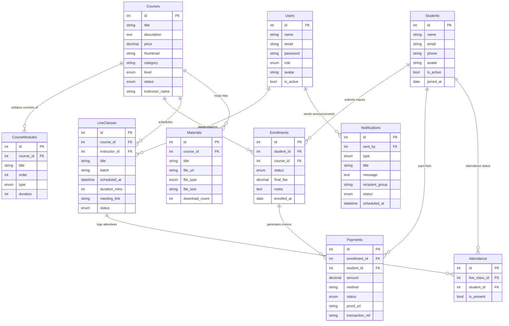

# EduAdmin — E-Learning Full-Stack Platform

> A production-ready, high-fidelity **E-Learning Administration Platform** and **Student Mobile Application** designed for managing course syllabus curriculum, student registrations, enrollment workflows, payment verifications, live classes, and downloadable materials — built with a modern React admin frontend, a Node.js/Express REST API, and a Flutter mobile student client.

---

## 📋 Table of Contents

1. [System Overview](#1-system-overview)
2. [Tech Stack](#2-tech-stack)
3. [Repository Structure](#3-repository-structure)
4. [Architecture Diagram](#4-architecture-diagram)
5. [User Roles & Access](#5-user-roles--access)
6. [Feature Flows](#6-feature-flows)
   - [Authentication Flow](#61-authentication-flow)
   - [Enrollment Workflow](#62-enrollment-workflow)
   - [Payment Flow](#63-payment-flow)
   - [Course Syllabus & Modules Flow](#64-course-syllabus--modules-flow)
7. [Database Schema](#7-database-schema)
8. [Backend API Reference](#8-backend-api-reference)
9. [Frontend Routing (Admin)](#9-frontend-routing-admin)
10. [Student Mobile App Routing (Flutter)](#10-student-mobile-app-routing-flutter)
11. [Getting Started](#11-getting-started)
12. [Key Design Decisions](#12-key-design-decisions)

---

## 1. System Overview

EduAdmin is a unified multi-platform e-learning solution containing three primary modules:

| Application / Module | Directory | Interface / Port | Core Responsibility |
|---|---|---|---|
| **Frontend Admin** | `frontend/` | `http://localhost:5173` | React-based Single Page App for Admins & Super Admins |
| **Backend REST API** | `server/` | `http://localhost:5000` | Express REST API powered by Sequelize ORM & MySQL |
| **Student App** | `student_app/` | `iOS / Android` | Flutter native student app for viewing lectures & syllabus |

**External System Integrations:**
- **MySQL 8** — Primary relational datastore synced automatically via Sequelize
- **Nodemailer** — Local SMTP/Mailtrap setup for dispatching automated payment receipts & reminders
- **Multer** — Disk storage handlers for syllabus documents, course thumbnails, and payment proofs

---

## 2. Tech Stack

### Frontend Admin (`frontend/`)
* **Framework**: React 18 (Vite 4 bundler)
* **Routing**: React Router DOM v6
* **Styling**: Tailwind CSS v3.4 (with customized backdrop-blur glassmorphism utilities)
* **Animations**: physics-based transitions via Framer Motion
* **Analytics**: responsive KPI chart elements via Recharts
* **Icons**: sleek typography using Lucide React icons
* **Notifications**: rich feedback via Sonner alerts

### Backend API (`server/`)
* **Runtime**: Node.js 18 (Express 4)
* **Database Access**: Sequelize 6 ORM
* **Security & Auth**: Stateless JWT (`jsonwebtoken`) + bcryptjs password hashing hooks
* **File Handling**: Multer multipart forms
* **Emails**: Automated SMTP Nodemailer mailers
* **Logging & Rates**: Morgan request logger + Express Rate Limiter security shields

### Student Mobile Client (`student_app/`)
* **Framework**: Flutter 3 (Dart)
* **State Management**: ChangeNotifier Provider architecture
* **Navigation**: Declarative routing via GoRouter
* **HTTP Layer**: Dio client with interceptors
* **Caching**: SharedPreferences local token & offline state persistence
* **Design Guidelines**: Google Material 3 customized theme parameters

---

## 3. Repository Structure

```
e-learning/
├── frontend/                    # React + Vite Admin Panel
│   ├── index.html
│   ├── vite.config.js
│   ├── tailwind.config.js
│   └── src/
│       ├── App.jsx              # Root router & Toaster providers
│       ├── main.jsx             # Entry point
│       ├── index.css            # Custom CSS themes & glassmorphism variables
│       ├── lib/
│       │   ├── api.js           # Axios client configured with JWT interceptors
│       │   └── utils.js         # cn() tailwind-merge helper
│       ├── components/
│       │   ├── layout/
│       │   │   ├── Sidebar.jsx  # Collapsible Sidebar with Framer Motion
│       │   │   ├── Topbar.jsx   # Header with profile triggers
│       │   │   └── AppLayout.jsx# Main layout shell
│       │   └── ui/              # shadcn/ui components
│       └── pages/
│           ├── Dashboard.jsx    # KPI widgets & interactive metrics
│           ├── Courses.jsx      # Overhauled Catalog & Course Syllabus curriculum manager
│           ├── Students.jsx     # Student records directory
│           ├── EnrollmentRequests.jsx # 8-stage enrollment workflow tracker
│           ├── Payments.jsx     # Revenue stats & transaction ledger
│           ├── LiveClasses.jsx  # Calendar schedule & Attendance tracker
│           ├── Materials.jsx    # Downloadable course resources
│           ├── Notifications.jsx# Global announcements broadcaster
│           ├── Reports.jsx      # Financial & academic statistics
│           └── Settings.jsx     # Admin configurations
│
├── server/                      # Node.js Express Backend
│   ├── server.js                # Server entry, database authenticate, & model sync
│   ├── config/
│   │   └── database.js          # Sequelize connection settings
│   ├── models/                  # Database Schema Definitions
│   │   ├── index.js             # Table associations loader
│   │   ├── User.js              # Admin credentials (super_admin / admin roles)
│   │   ├── Course.js            # Course catalog
│   │   ├── CourseModule.js      # Lesson curriculum (video, pdf, quiz)
│   │   ├── Student.js           # Student registrations
│   │   ├── Enrollment.js        # 8-stage course inquiries
│   │   ├── Payment.js           # Fee transactions & receipts
│   │   ├── LiveClass.js         # Video conference sessions
│   │   ├── Attendance.js        # Attendance logs
│   │   ├── Material.js          # Files & readings
│   │   └── Notification.js      # Broadcast message records
│   ├── controllers/             # Backend Business Logic Controllers
│   │   ├── courseController.js  # Course & newly added CourseModule CRUD controls
│   │   ├── dashboardController.js
│   │   ├── enrollmentController.js
│   │   └── studentCourseController.js # Course fetch APIs for the mobile app
│   ├── routes/                  # API routing middleware
│   ├── middleware/
│   │   └── auth.js              # Token validation and role check policies
│   ├── utils/
│   │   └── response.js          # Unified { success, message, data } formatter
│   └── seed.js                  # Database seeder execution script
│
└── student_app/                 # Flutter Student Mobile App
    ├── lib/
    │   ├── main.dart            # Multi-provider + routing initialization
    │   ├── models/              # Dart models (CourseModel, UserModel)
    │   ├── services/            # Dio-based remote API services
    │   ├── providers/           # Course & Auth change notifier providers
    │   └── screens/             # Flutter screens (Home, CourseDetail, Materials)
```

---

## 4. Architecture Diagram



---

## 5. User Roles & Access



---

## 6. Feature Flows

### 6.1 Authentication Flow



### 6.2 Enrollment Workflow

Tracks 8 customized administrative stages: Inquiry ➔ Review ➔ Contacted ➔ Fee Set ➔ Payment Requested ➔ Payment Verification ➔ Enrolled (or Rejected).



### 6.3 Payment Flow



### 6.4 Course Syllabus & Modules Flow

This system allows full management of course curriculums. Selecting a course transitions the catalog view into a detailed syllabus workspace.



---

## 7. Database Schema



---

## 8. Backend API Reference

### Authentication
| Method | Endpoint | Auth | Description |
|---|---|---|---|
| `POST` | `/api/auth/login` | Public | Admin email verification -> Returns signed JWT token |
| `GET` | `/api/auth/me` | 🔒 JWT | Returns active admin profile state |

### Course Catalog & Syllabus Modules
| Method | Endpoint | Auth | Description |
|---|---|---|---|
| `GET` | `/api/courses` | 🔒 JWT | Paginated list of courses (filters status/category) |
| `POST` | `/api/courses` | 🔒 Admin | Register a new course catalog |
| `GET` | `/api/courses/:id` | 🔒 JWT | Single course catalog + **included CourseModules list** |
| `PUT` | `/api/courses/:id` | 🔒 Admin | Edit course details |
| `DELETE` | `/api/courses/:id` | 🔒 Super Admin | Destroys course record |
| `GET` | `/api/courses/:courseId/modules` | 🔒 JWT | Fetches syllabus modules list sorted by display order |
| `POST` | `/api/courses/:courseId/modules` | 🔒 Admin | Add a syllabus chapter (video, pdf, or quiz) |
| `PUT` | `/api/courses/:courseId/modules/:id` | 🔒 Admin | Edit module sequence, type, or duration |
| `DELETE` | `/api/courses/:courseId/modules/:id` | 🔒 Admin | Deletes curriculum module |

### Student Directory
| Method | Endpoint | Auth | Description |
|---|---|---|---|
| `GET` | `/api/students` | 🔒 JWT | Paginated and searchable directories |
| `POST` | `/api/students` | 🔒 Admin | Register new student record |
| `GET` | `/api/students/:id` | 🔒 JWT | Profiles with complete course progress maps |
| `DELETE` | `/api/students/:id` | 🔒 Super Admin | Remove student profile |

### Enrollment Requests
| Method | Endpoint | Auth | Description |
|---|---|---|---|
| `GET` | `/api/enrollments` | 🔒 JWT | List enrollment pipeline entries |
| `PATCH` | `/api/enrollments/:id/status` | 🔒 Admin | Update pipeline stage |
| `PATCH` | `/api/enrollments/:id/set-fee` | 🔒 Admin | Set final settled fee |
| `POST` | `/api/enrollments/:id/send-payment-request`| 🔒 Admin | Dispatches fee instructions via email |

### Payments & Invoicing
| Method | Endpoint | Auth | Description |
|---|---|---|---|
| `GET` | `/api/payments` | 🔒 JWT | Complete transaction ledgers |
| `PATCH` | `/api/payments/:id/verify` | 🔒 Admin | Verify payment receipt, auto-approve course enrollment |
| `POST` | `/api/payments/:id/proof` | 🔒 Admin | Upload payment receipt document |

### Student API (Flutter Client Endpoints)
| Method | Endpoint | Auth | Description |
|---|---|---|---|
| `POST` | `/api/student/register` | Public | Student self-registration |
| `POST` | `/api/student/login` | Public | Student login token generation |
| `GET` | `/api/student/me` | 🔒 Student | Retrieve active profile details |
| `GET` | `/api/student/courses` | Public | Returns all active 'published' courses |
| `GET` | `/api/student/courses/:id` | Public | Fetch specific syllabus content & modules |
| `POST` | `/api/student/enroll` | 🔒 Student | Submits new enrollment pipeline entry |
| `GET` | `/api/student/my-enrollments` | 🔒 Student | List purchased or pending courses |
| `GET` | `/api/student/courses/:id/materials` | 🔒 Student | Fetch downloadable files for enrolled courses |

---

## 9. Frontend Routing (Admin)

All admin interface routes are rendered within the modern collapsible `<AppLayout>` layout wrapper:

| Path URL | Component Page | Purpose |
|---|---|---|
| `/` | `Dashboard` | Admin core stats, financial aggregates, calendar summaries |
| `/courses` | `Courses` | Syllabus workspace, modules manager, category filter boards |
| `/students` | `Students` | Directory profiles, performance scores, attendance lists |
| `/enrollments` | `EnrollmentRequests` | 8-stage admissions board with instant action approvals |
| `/payments` | `Payments` | Financial receipts auditing, transactions charts |
| `/live-classes`| `LiveClasses` | Video meetings calendar scheduler & attendance checklists |
| `/materials` | `Materials` | Document repository, upload managers, file counters |
| `/notifications`| `Notifications` | Mass email/push notifications form dashboard |
| `/reports` | `Reports` | Custom analytical aggregations and CSV exporters |
| `/settings` | `Settings` | Profile secrets, payment API gateway configurations |

---

## 10. Student Mobile App Routing (Flutter)

The mobile client leverages declarative navigation mapping through the `GoRouter` router:

| Route Path | Mobile Screen Screen | Screen Responsibility |
|---|---|---|
| `/` | `SplashScreen` | App logo assets, verification of token persistence |
| `/login` | `LoginScreen` | Student email/password auth validator |
| `/register` | `RegisterScreen` | Enrollment inquiries self-signups |
| `/home` | `HomeScreen` | Recommended courses feed & ongoing course tabs |
| `/course/:id` | `CourseDetailScreen` | Visual course details syllabus & lessons list |
| `/my-courses` | `MyCoursesScreen` | Quick access tabs for purchased course study |
| `/materials/:id`| `MaterialsScreen` | Local PDF readers & video progress screens |
| `/profile` | `ProfileScreen` | Edit student details & configurations |

---

## 11. Getting Started

### System Prerequisites
* **Node.js** >= 18.x
* **NPM** >= 9.x
* **MySQL** >= 8.0
* **Flutter SDK** >= 3.x

### 1. Database Creation
```sql
CREATE DATABASE elearning_db;
```

### 2. Backend Initialization
```bash
cd server
cp .env.example .env
# Edit details inside .env with your MySQL credentials

npm install
npm run dev # Starts Node API & auto-synchronizes database models (Port: 5000)

# Run standard seeders
npm run seed # Creates default super_admin account: admin@eduadmin.com / admin123
```

### 3. Admin Panel Initialization
```bash
cd frontend
npm install
npm run dev # Launches React SPA workspace on Vite local server (Port: 5173)
```

### 4. Mobile Client Launch
```bash
cd student_app
flutter pub get
flutter run # Launches Flutter application in connected emulator or physical device
```

---

## 12. Key Design Decisions

| Architectural Decision | Rationale |
|---|---|
| **Syllabus details workflow** | Added a clean catalog-to-details transition. Admins can manage lesson orders, types, and minutes in a single, high-fidelity curriculum workspace. |
| **Monorepo Directory Layout** | Groups client web code, database APIs, and Flutter mobile services together for easier syncing and deployment orchestration. |
| **Sequelize Auto-Sync** | Automatically translates database associations and schemas in development, ensuring no mismatch between code definitions and SQL tables. |
| **Stateless JWT Validation** | Employs encrypted tokens in requests to authenticate users, ensuring smooth, server-independent scaling. |
| **Local Upload Multer storage** | Files are stored under local directories for development testing; easy to swap with AWS S3 in production by adapting the middleware controller. |
| **Glassmorphism Backdrop Themes** | Custom Tailwind CSS variables and filter drop-shadow properties enforce a premium dark-mode aesthetic across panels. |
| **Standardized Responses** | Every endpoint yields `{ success: boolean, message: string, data: any }` formats to simplify frontend networking. |

---

*EduAdmin — Engineered with visual precision & complete full-stack integration | v1.1*
