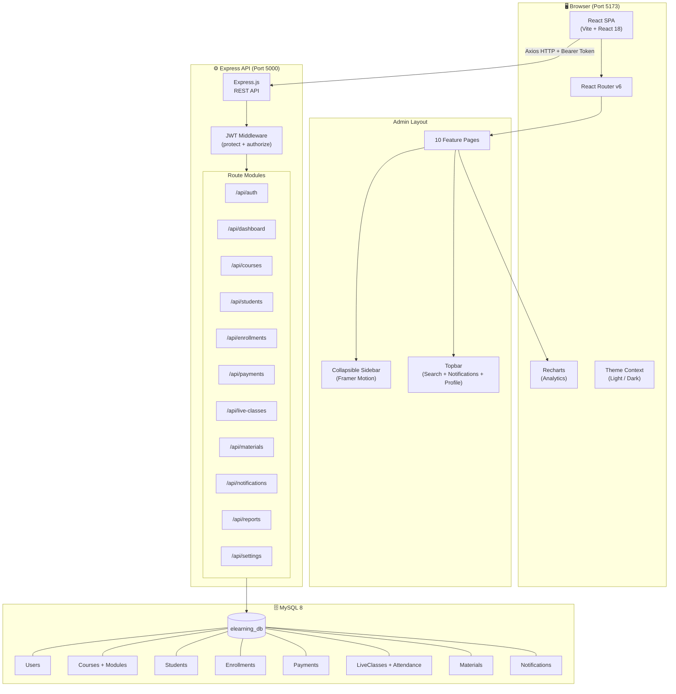
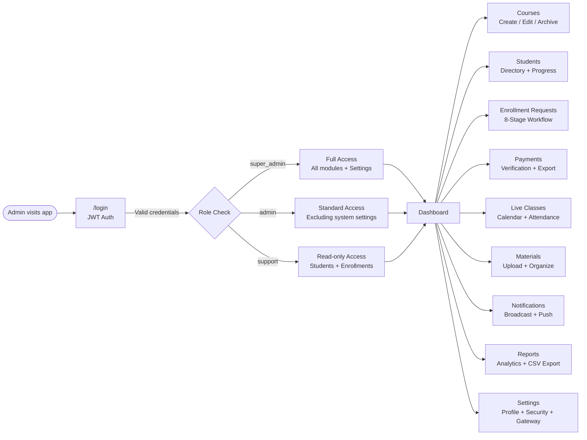
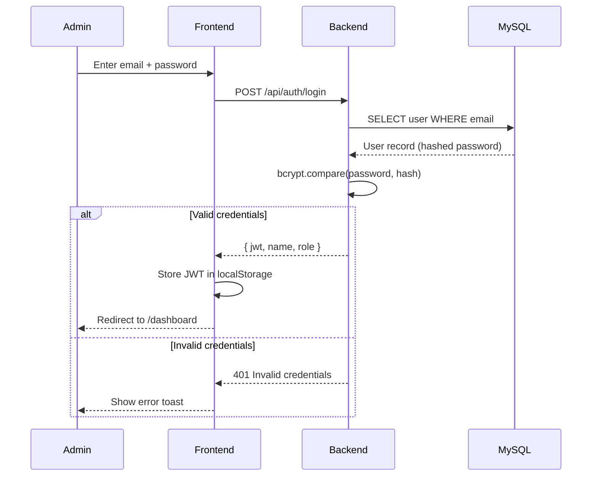
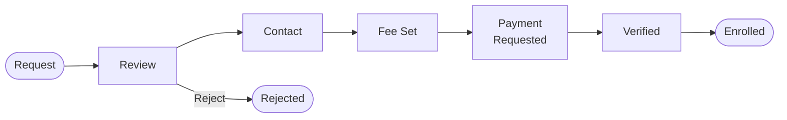
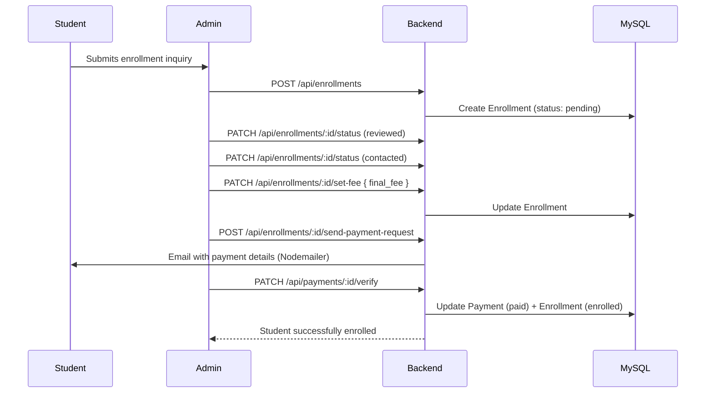
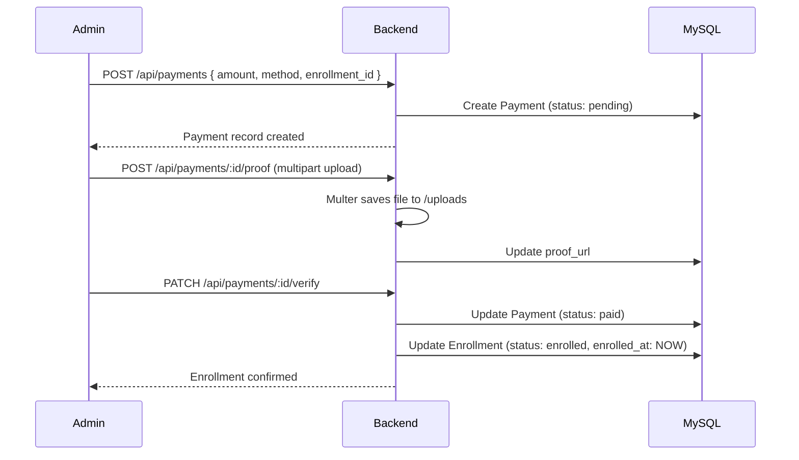
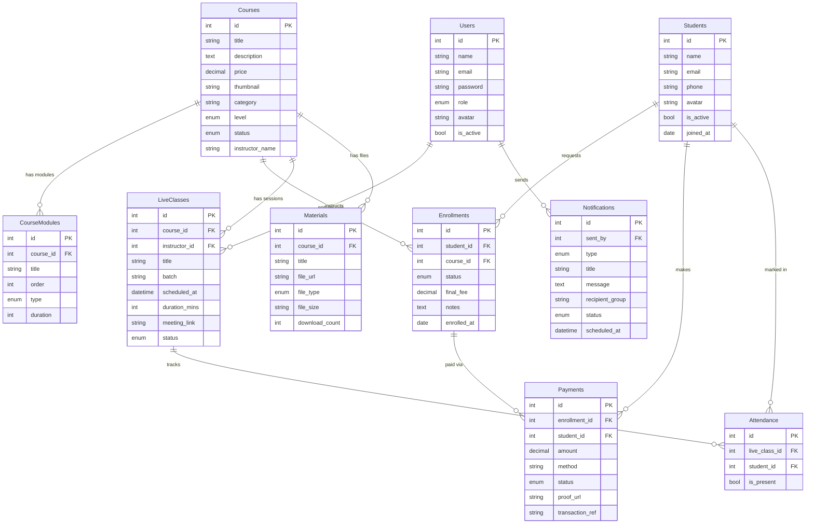

# EduAdmin — E-Learning Admin Panel

> A full-stack, production-ready **E-Learning Administration Platform** for managing courses, students, enrollment workflows, live classes, payments, and learning materials — built with a modern React frontend and a Node.js/MySQL backend.

---

## Table of Contents

1. [System Overview](#1-system-overview)
2. [Tech Stack](#2-tech-stack)
3. [Repository Structure](#3-repository-structure)
4. [Architecture Diagram](#4-architecture-diagram)
5. [User Roles & Access](#5-user-roles--access)
6. [Feature Flows](#6-feature-flows)
   - [Authentication Flow](#61-authentication-flow)
   - [Enrollment Workflow](#62-enrollment-workflow)
   - [Payment Flow](#63-payment-flow)
7. [Database Schema](#7-database-schema)
8. [Backend API Reference](#8-backend-api-reference)
9. [Frontend Routing](#9-frontend-routing)
10. [Getting Started](#10-getting-started)
11. [Key Design Decisions](#11-key-design-decisions)

---

## 1. System Overview

EduAdmin is a **monorepo** containing two applications:

| Application | Directory | Port / Platform | Purpose |
|---|---|---|---|
| **Frontend Admin** | `frontend/` | `5173` | React Admin SPA (Vite) |
| **Backend API** | `server/` | `5000` | Node.js REST API + Sequelize |
| **Student App** | `student_app/` | `Android / iOS` | Flutter Mobile Learning App |

**External Dependencies:**
- **MySQL 8** — Primary relational database via Sequelize ORM
- **Nodemailer** — SMTP email delivery for student notifications
- **Multer** — File uploads for course materials and payment proofs

---

## 2. Tech Stack

### Frontend (`frontend/`)

| Layer | Technology |
|---|---|
| Framework | **React 18** |
| Build Tool | **Vite 4** |
| Routing | **React Router DOM v6** |
| Styling | **Tailwind CSS v3.4** + Glassmorphism utilities |
| Animations | **Framer Motion** |
| Charts | **Recharts** |
| Icons | **Lucide React** |
| UI Primitives | **shadcn/ui** (Radix UI based) |
| HTTP Client | **Axios** (planned) |
| Typography | **Inter** (Google Fonts) |

### Backend (`server/`)

| Layer | Technology |
|---|---|
| Runtime | **Node.js 18** |
| Framework | **Express 4** |
| ORM | **Sequelize 6** |
| Database | **MySQL 8** |
| Auth | **JWT** (`jsonwebtoken`) + **bcryptjs** |
| Validation | **express-validator** |
| File Uploads | **Multer** |
| Email | **Nodemailer** |
| Logging | **Morgan** |
| Rate Limiting | **express-rate-limit** |
| Dev Server | **Nodemon** |

### Student Mobile (`student_app/`)

| Layer | Technology |
|---|---|
| Framework | **Flutter 3** |
| Language | **Dart** |
| State | **Provider** |
| Navigation | **GoRouter** |
| Networking | **Dio** |
| Local Storage | **SharedPreferences** |
| UI Theme | Material 3 + Indigo/Purple Palette |
| Fonts | **Google Fonts** (Inter) |
| Utilities | `cached_network_image`, `flutter_vector_icons`, `intl` |

---

## 3. Repository Structure

```
e-learning/
├── frontend/                    # React + Vite Admin Panel
│   ├── index.html
│   ├── vite.config.js
│   ├── tailwind.config.js
│   └── src/
│       ├── App.jsx              # Root router (React Router v6)
│       ├── main.jsx             # Entry point
│       ├── index.css            # CSS variables, glassmorphism, scrollbar
│       ├── lib/
│       │   └── utils.js         # cn() class merging utility
│       ├── data/
│       │   └── mockData.js      # Mock datasets for all modules
│       ├── hooks/               # Custom React hooks
│       ├── components/
│       │   ├── layout/
│       │   │   ├── Sidebar.jsx  # Collapsible navigation with Framer Motion
│       │   │   ├── Topbar.jsx   # Search, notifications, dark mode, profile
│       │   │   └── AppLayout.jsx# Main shell with theme persistence
│       │   ├── charts/          # Recharts wrappers
│       │   ├── dashboard/       # Dashboard-specific widgets
│       │   ├── courses/         # Course card, grid components
│       │   ├── students/        # Student profile components
│       │   ├── enrollments/     # Workflow progress tracker
│       │   ├── payments/        # Payment table and stats
│       │   ├── live-classes/    # Calendar components
│       │   ├── materials/       # File manager components
│       │   ├── notifications/   # Composer and history
│       │   ├── reports/         # Advanced chart components
│       │   ├── settings/        # Settings form sections
│       │   └── ui/              # shadcn/ui base primitives
│       └── pages/
│           ├── Dashboard.jsx
│           ├── Courses.jsx
│           ├── Students.jsx
│           ├── EnrollmentRequests.jsx
│           ├── Payments.jsx
│           ├── LiveClasses.jsx
│           ├── Materials.jsx
│           ├── Notifications.jsx
│           ├── Reports.jsx
│           └── Settings.jsx
│
└── server/                      # Node.js Express Backend
    ├── server.js                # Entry point, middleware, DB sync
    ├── .env                     # Environment variables (gitignored)
    ├── .env.example             # Environment template
    ├── config/
    │   └── database.js          # Sequelize connection config
    ├── models/
    │   ├── index.js             # Model loader + all associations
    │   ├── User.js              # Admin users (bcrypt hooks)
    │   ├── Course.js            # Course catalog
    │   ├── CourseModule.js      # Curriculum structure
    │   ├── Student.js           # Student profiles
    │   ├── Enrollment.js        # Admission workflow (8-stage)
    │   ├── Payment.js           # Transaction records
    │   ├── LiveClass.js         # Scheduled sessions
    │   ├── Attendance.js        # Per-class attendance
    │   ├── Material.js          # Course files/resources
    │   └── Notification.js      # Broadcast system
    ├── controllers/             # Business logic per module
    ├── routes/                  # Express route definitions
    ├── middleware/
    │   └── auth.js              # JWT protect + role authorize
    ├── utils/
    │   ├── response.js          # Standardized API responses
    │   ├── mailer.js            # Nodemailer helper
    │   └── pagination.js        # Reusable paginator
    ├── seeders/
    │   └── adminSeeder.js       # Default super admin account
    └── uploads/                 # Multer file storage
│
└── student_app/                 # Flutter Student Mobile App
    ├── lib/
    │   ├── main.dart            # App entry + GoRouter + Providers
    │   ├── core/                # Constants, Theme, Network client
    │   ├── models/              # Dart Data Models (User, Course)
    │   ├── services/            # API Services (Auth, Course)
    │   ├── providers/           # State Management (Auth, Course)
    │   ├── widgets/             # Reusable UI components (CourseCard)
    │   └── screens/             # UI Screens (Login, Home, Profile)
    └── pubspec.yaml             # Flutter dependencies
```

---

## 4. Architecture Diagram



---

## 5. User Roles & Access



---

## 6. Feature Flows

### 6.1 Authentication Flow



### 6.2 Enrollment Workflow

The enrollment system tracks 8 stages from inquiry to full admission:





### 6.3 Payment Flow



---

## 7. Database Schema



---

## 8. Backend API Reference

### Authentication
| Method | Endpoint | Auth | Description |
|---|---|---|---|
| `POST` | `/api/auth/login` | Public | Admin login → returns JWT |
| `GET` | `/api/auth/me` | 🔒 JWT | Get current admin profile |

### Dashboard
| Method | Endpoint | Auth | Description |
|---|---|---|---|
| `GET` | `/api/dashboard/stats` | 🔒 JWT | KPI cards (revenue, students, courses) |
| `GET` | `/api/dashboard/recent-enrollments` | 🔒 JWT | Last 5 enrollment requests |
| `GET` | `/api/dashboard/upcoming-classes` | 🔒 JWT | Next scheduled live sessions |
| `GET` | `/api/dashboard/revenue-chart` | 🔒 JWT | Monthly revenue series |
| `GET` | `/api/dashboard/student-growth` | 🔒 JWT | Student join trend |

### Courses
| Method | Endpoint | Auth | Description |
|---|---|---|---|
| `GET` | `/api/courses` | 🔒 JWT | List all (paginated, filter by category/status) |
| `POST` | `/api/courses` | 🔒 Admin | Create course |
| `GET` | `/api/courses/:id` | 🔒 JWT | Single course details |
| `PUT` | `/api/courses/:id` | 🔒 Admin | Update course |
| `DELETE` | `/api/courses/:id` | 🔒 Super Admin | Delete course |
| `GET` | `/api/courses/:id/modules` | 🔒 JWT | Get curriculum modules |
| `POST` | `/api/courses/:id/modules` | 🔒 Admin | Add module |
| `PUT` | `/api/courses/:id/modules/:moduleId` | 🔒 Admin | Update module |
| `DELETE` | `/api/courses/:id/modules/:moduleId` | 🔒 Admin | Remove module |
| `POST` | `/api/courses/:id/thumbnail` | 🔒 Admin | Upload thumbnail |

### Students
| Method | Endpoint | Auth | Description |
|---|---|---|---|
| `GET` | `/api/students` | 🔒 JWT | List students (search, paginate) |
| `POST` | `/api/students` | 🔒 Admin | Add student |
| `GET` | `/api/students/:id` | 🔒 JWT | Profile + progress |
| `PUT` | `/api/students/:id` | 🔒 Admin | Update student |
| `DELETE` | `/api/students/:id` | 🔒 Super Admin | Delete student |
| `GET` | `/api/students/:id/enrollments` | 🔒 JWT | Student's course history |
| `GET` | `/api/students/:id/payments` | 🔒 JWT | Student's payment history |
| `GET` | `/api/students/:id/attendance` | 🔒 JWT | Attendance records |

### Enrollment Requests
| Method | Endpoint | Auth | Description |
|---|---|---|---|
| `GET` | `/api/enrollments` | 🔒 JWT | List all (filter by status) |
| `POST` | `/api/enrollments` | 🔒 JWT | Create request |
| `GET` | `/api/enrollments/:id` | 🔒 JWT | Request details |
| `PATCH` | `/api/enrollments/:id/status` | 🔒 Admin | Update workflow stage |
| `PATCH` | `/api/enrollments/:id/set-fee` | 🔒 Admin | Set final fee |
| `POST` | `/api/enrollments/:id/send-payment-request` | 🔒 Admin | Email payment request |
| `POST` | `/api/enrollments/:id/approve` | 🔒 Admin | Approve & enroll |
| `POST` | `/api/enrollments/:id/reject` | 🔒 Admin | Reject request |

### Payments
| Method | Endpoint | Auth | Description |
|---|---|---|---|
| `GET` | `/api/payments` | 🔒 JWT | List all transactions |
| `POST` | `/api/payments` | 🔒 Admin | Record payment |
| `GET` | `/api/payments/:id` | 🔒 JWT | Payment details |
| `PATCH` | `/api/payments/:id/verify` | 🔒 Admin | Verify + approve enrollment |
| `PATCH` | `/api/payments/:id/status` | 🔒 Admin | Update status |
| `POST` | `/api/payments/:id/proof` | 🔒 Admin | Upload proof image |
| `GET` | `/api/payments/:id/invoice` | 🔒 JWT | Invoice data |

### Live Classes
| Method | Endpoint | Auth | Description |
|---|---|---|---|
| `GET` | `/api/live-classes` | 🔒 JWT | List (filter by date/batch) |
| `POST` | `/api/live-classes` | 🔒 Admin | Schedule class |
| `PUT` | `/api/live-classes/:id` | 🔒 Admin | Update class |
| `DELETE` | `/api/live-classes/:id` | 🔒 Admin | Cancel class |
| `GET` | `/api/live-classes/:id/attendance` | 🔒 JWT | Get attendance list |
| `POST` | `/api/live-classes/:id/attendance` | 🔒 Admin | Mark attendance |

### Materials
| Method | Endpoint | Auth | Description |
|---|---|---|---|
| `GET` | `/api/materials` | 🔒 JWT | List by course |
| `POST` | `/api/materials` | 🔒 Admin | Upload file (multipart) |
| `DELETE` | `/api/materials/:id` | 🔒 Admin | Delete material |
| `PATCH` | `/api/materials/:id/download` | 🔒 JWT | Increment download count |

### Notifications
| Method | Endpoint | Auth | Description |
|---|---|---|---|
| `GET` | `/api/notifications` | 🔒 JWT | List sent notifications |
| `POST` | `/api/notifications` | 🔒 Admin | Send notification |
| `DELETE` | `/api/notifications/:id` | 🔒 Admin | Delete |

### Reports
| Method | Endpoint | Auth | Description |
|---|---|---|---|
| `GET` | `/api/reports/revenue` | 🔒 JWT | Revenue breakdown (by period) |
| `GET` | `/api/reports/students` | 🔒 JWT | Student acquisition trend |
| `GET` | `/api/reports/courses` | 🔒 JWT | Course performance stats |
| `GET` | `/api/reports/export/csv` | 🔒 Admin | Export data as CSV |

### Settings
| Method | Endpoint | Auth | Description |
|---|---|---|---|
| `PUT` | `/api/settings/profile` | 🔒 JWT | Update admin profile |
| `PUT` | `/api/settings/smtp` | 🔒 Super Admin | Update SMTP config |
| `PUT` | `/api/settings/payment-gateway` | 🔒 Super Admin | Update payment gateway |

### Student API (Mobile App)
| Method | Endpoint | Auth | Description |
|---|---|---|---|
| `POST` | `/api/student/register` | Public | Student self-registration |
| `POST` | `/api/student/login` | Public | Student login → returns JWT |
| `GET` | `/api/student/me` | 🔒 Student | Get student profile |
| `GET` | `/api/student/courses` | Public | Browse active courses |
| `GET` | `/api/student/courses/:id` | Public | Course details + modules |
| `POST` | `/api/student/enroll` | 🔒 Student | Submit enrollment request |
| `GET` | `/api/student/my-enrollments` | 🔒 Student | List student's enrollments |
| `GET` | `/api/student/courses/:id/materials` | 🔒 Student* | Access course files (Enrolled only) |

---

## 9. Student App Routing (Flutter)

The mobile app uses a declarative routing system via `GoRouter`.

| Route | Screen | Description |
|---|---|---|
| `/` | `SplashScreen` | App branding + Auth session check |
| `/login` | `LoginScreen` | Student email/password login |
| `/register` | `RegisterScreen` | New student account creation |
| `/home` | `HomeScreen` | Personalized dashboard + Course discovery |
| `/course/:id` | `CourseDetailScreen` | Syllabus and enrollment actions |
| `/my-courses` | `MyCoursesScreen` | Enrolled courses list |
| `/materials/:id` | `MaterialsScreen` | Course content & downloads |
| `/profile` | `ProfileScreen` | Account management |

---

## 10. Frontend Routing (Admin)

All routes are wrapped by `<AppLayout>` which provides the sidebar and topbar.

| Path | Page Component | Description |
|---|---|---|
| `/` | `Dashboard` | KPI stats, revenue chart, student growth, recent activity |
| `/courses` | `Courses` | Course grid with category filters and quick-add |
| `/students` | `Students` | Student directory with search and progress bars |
| `/enrollments` | `EnrollmentRequests` | 8-stage workflow table with approve/reject actions |
| `/payments` | `Payments` | Revenue analytics + transaction ledger |
| `/live-classes` | `LiveClasses` | Monthly calendar + session management |
| `/materials` | `Materials` | Folder-based file manager with download tracking |
| `/notifications` | `Notifications` | Broadcast composer + sent history |
| `/reports` | `Reports` | Advanced charts: bar, pie, trend analytics |
| `/settings` | `Settings` | Profile, security toggles, danger zone |
| `*` | Redirect | Any unknown route → `/` |

---

## 11. Getting Started

### Prerequisites

```bash
node >= 18.x
npm  >= 9.x
MySQL >= 8.0
Flutter >= 3.x
```

### 1. Clone & Setup

```bash
git clone <repo-url>
cd e-learning
```

### 2. Database Setup

```sql
-- Run in your MySQL client
CREATE DATABASE elearning_db;
```

### 3. Backend Setup

```bash
cd server

# Copy and edit environment variables
cp .env.example .env
# Edit .env with your MySQL credentials and JWT secret

# Install dependencies
npm install

# Start server (auto-syncs Sequelize models)
npm run dev
# → http://localhost:5000

# Seed default admin account
npm run seed
# Creates: admin@eduadmin.com / admin123
```

**Backend `.env`:**
```env
PORT=5000
NODE_ENV=development

DB_HOST=localhost
DB_USER=root
DB_PASS=your_mysql_password
DB_NAME=elearning_db

JWT_SECRET=your_super_secret_key_here
JWT_EXPIRE=24h

SMTP_HOST=smtp.mailtrap.io
SMTP_PORT=2525
SMTP_USER=
SMTP_PASS=
FROM_EMAIL=noreply@eduadmin.com
```

### 4. Frontend Setup

```bash
cd frontend

# Install dependencies
npm install

# Start dev server
npm run dev
# → http://localhost:5173
```

### 5. Student App Setup (Flutter)

```bash
cd student_app

# Fetch Flutter packages
flutter pub get

# Run on connected device or emulator
flutter run
```

### 6. Running Everything Together

```bash
# Terminal 1 — Backend
cd server && npm run dev

# Terminal 2 — Admin Panel
cd frontend && npm run dev

# Terminal 3 — Student Mobile
cd student_app && flutter run
```

### Health Check

```bash
curl http://localhost:5000/api
# Expected: { "message": "E-Learning Admin API is running" }
```

---

## 11. Key Design Decisions

| Decision | Rationale |
|---|---|
| **Monorepo structure** | `frontend/` and `server/` co-located in one repo for simpler deployment and version sync |
| **Sequelize ORM** | Abstracts MySQL queries, provides migrations and model-level hooks (e.g. password hashing) |
| **JWT stateless auth** | No session store needed; scales horizontally without Redis |
| **bcryptjs hooks** | Password hashing happens at the model layer (beforeCreate/beforeUpdate), not in controllers |
| **8-stage enrollment workflow** | Maps the real-world admin process: inquiry → verification → payment → enrollment |
| **Multer local storage** | Keeps uploads simple for development; swap to S3 in production by changing the storage engine |
| **Framer Motion** | Declarative, physics-based animations for the sidebar and page transitions |
| **Glassmorphism CSS utilities** | Custom Tailwind utilities ensure consistent blur/transparency effects across all cards |
| **Recharts for analytics** | Lightweight, composable, and fully responsive without a heavy charting dependency |
| **Standardized API responses** | `utils/response.js` enforces `{ success, message, data }` shape on every endpoint |

---

*EduAdmin — Built with ❤️ | Full-Stack E-Learning Platform v1.0*
